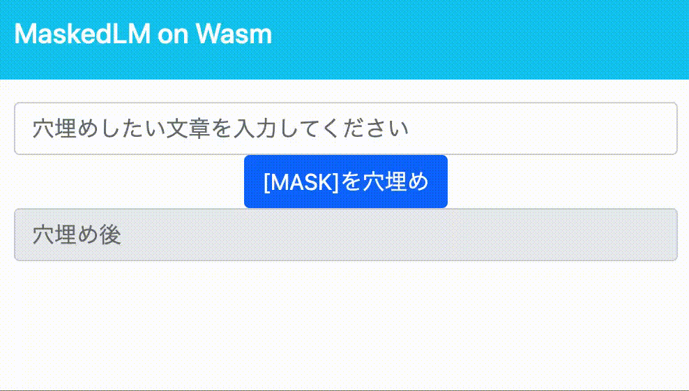

# Masked Language Model on Wasm

This project is for **OPTiM TECH BLOG**.

Please see below:  
[WebAssemblyを用いてBERTモデルをフロントエンドで動かす](https://tech-blog.optim.co.jp/entry/2021/08/13/100000)

## Demo

## Usage

1. Build image
   `docker build -t masked-lm-image .`
2. Run container
   `docker run --rm -it -p 8080:80 masked-lm-image`
3. Open [localhost:8080](localhost:8080) in browser

## LICENCE

[MIT Licesne](./LICENSE)
